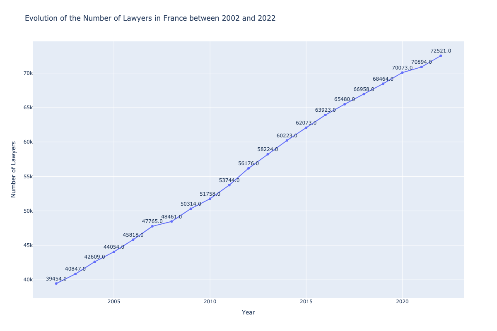

# dlt x yato 🥑🇫🇷



## Overview

This project analyzes and visualizes the evolution of the number of lawyers in France over time. Using public data, I created a data pipeline to process, analyze, and visualize this information.

The main objective is to provide insights into the growth and distribution of the legal profession in France.
## Data Source

The project utilizes data from the French government's open data platform. The dataset is accessed directly from [link](https://static.data.gouv.fr/resources/evolution-du-nombre-davocats-en-france-par-barreau/20240403-143707/nombre-par-barreau.csv).


This CSV file contains detailed information about the number of lawyers per bar association in France over time. The data is regularly updated, ensuring that our analysis reflects the most current trends in the French legal profession.

## Stack

Our data pipeline leverages two powerful tools for efficient data processing and transformation:

### dlt (data load tool)

[dlt](https://github.com/dlt-hub/dlt) is an open-source library that simplifies the process of extracting, normalizing, and loading data. Key features include:

- Automated schema inference and evolution
- Built-in data verification and error handling
- Support for various data sources and destinations

In this project, dlt is used for efficient data extraction from the CSV source and loading into our data processing pipeline.

### yato (yet another transformation orchestrator)

[yato](https://github.com/Bl3f/yato) is a lightweight SQL transformation orchestrator designed to work seamlessly with DuckDB. Its main advantages are:

- Efficient execution of SQL queries in the correct order
- Easy management of dependencies between transformations

We use yato, the smallest DuckDB SQL orchestrator on Earth, to orchestrate our SQL transformations on the extracted data. Yato works seamlessly with DuckDB, ensuring a clean and well-structured dataset for analysis.

The combination of dlt and yato, leveraging the power of DuckDB, creates a flexible, maintainable, and easy-to-understand data pipeline that forms the backbone of our analysis. This setup allows us to efficiently process and transform data using SQL queries within the DuckDB environment.

## Installation

To set up the project environment:

1. Clone the repository:
   ```
   git clone https://github.com/MohamedBsh/test-dlt-yato-avocado.git
   cd lawyers-france-evolution
   ```

2. Create and activate a virtual environment:
   ```
   python -m venv venv
   source venv/bin/activate 
   ```

3. Install the required dependencies:
   ```
   pip install -r requirements.txt
   ```

## Usage

To run the data pipeline and generate visualizations:

1. Ensure your virtual environment is activated.

2. Execute the main script:
   ```
   python app/pipeline.py
   ```

3. Clean the database
   ```
   python app/data_explorer.py
   Choose 'clean'
   ```

4. Explore the database
   ```
   python app/data_explorer.py
   Choose 'explore'
   ```

5. Visualize the data
   ```
   python generate_plot.py
   ```
